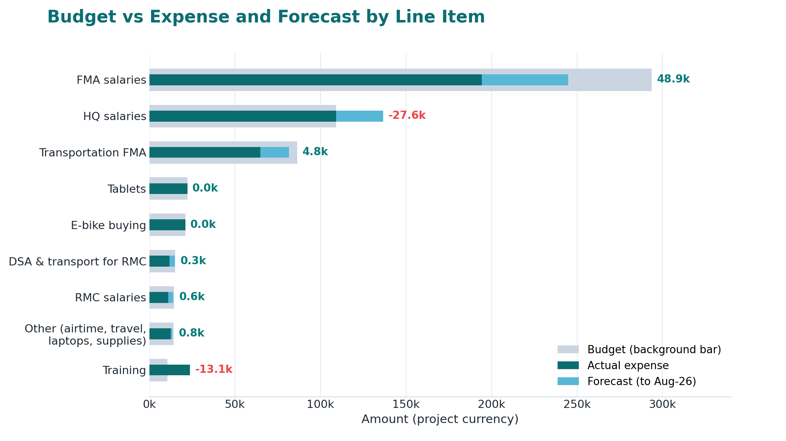
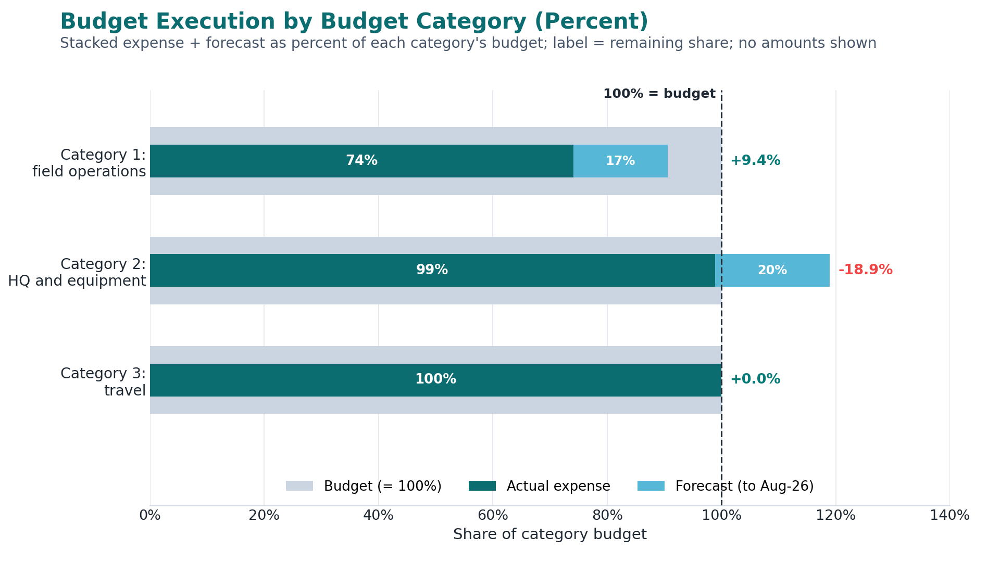

```{r setup}
#| include: false
# Charts are built from TPM_data.xlsx at render time and drawn as static images.
# Required packages: readxl, dplyr, tidyr, ggplot2, forcats, scales
library(readxl); library(dplyr); library(tidyr); library(ggplot2)
library(forcats); library(scales)

# Static figure defaults: a 16:9-friendly aspect so every chart fits the slide
# with no scrollbar (paired with the image CSS in the HTML block below).
knitr::opts_chunk$set(dev = "png", dpi = 200, fig.align = "center",
                      fig.width = 10.5, fig.height = 5.4)

SRC <- if (file.exists("TPM_data.xlsx")) "TPM_data.xlsx" else "../TPM_data.xlsx"

# ---- C4ED palette ----
PRIMARY <- "#0C6D71"; SECONDARY <- "#047B77"; BLUE <- "#56B7D7"
MINT <- "#A8D8D2"; PALE <- "#E4F2F0"; AMBER <- "#F0B429"
GREY <- "#94a3b8"; GREYL <- "#cbd5e1"; WARN <- "#F59E0B"; RED <- "#EF4444"
TEXTC <- "#1f2933"; MUTED <- "#475569"
mlab <- function(x) format(as.Date(x), "%b-%y")

theme_c4ed <- function(base_size = 16) {
  theme_minimal(base_size = base_size) +
    theme(panel.grid.minor = element_blank(),
          panel.grid.major = element_line(colour = "#e2e8f0",
                                          linewidth = 0.4),
          axis.text = element_text(colour = TEXTC, face = "bold"),
          axis.title = element_text(colour = TEXTC, face = "bold"),
          legend.position = "top", legend.title = element_blank(),
          legend.text = element_text(face = "bold"),
          strip.text = element_text(face = "bold", colour = TEXTC),
          axis.line = element_line(colour = GREY, linewidth = 0.5),
          axis.ticks = element_line(colour = GREY, linewidth = 0.5),
          plot.background = element_rect(fill = "white", colour = NA))
}

# ggplot -> responsive plotly widget that fills its container width (fixed
# height). The `w` argument is kept for backward compatibility but ignored:
# width is left unset so each chart fills 100% of its column or slide and sits
# flush left. A small resize hook (the HTML block just before "## Agenda")
# redraws any chart that starts life in a hidden tab.
intify <- function(p, tip = "text", h = NULL, w = NULL) {
  # Charts render as STATIC images (no plotly), so every chart scales to fit the
  # slide and never shows a scrollbar. The `text` aesthetic used for the old
  # tooltips is ignored by ggplot; tip/h/w are accepted but unused.
  p
}

# x-position for a label placed AFTER a bar end: plotly centres text on its
# anchor, so shift by half the estimated text width plus a small gap
lab_x <- function(end, lab, rng, gap = 0.012) {
  end + rng * gap + nchar(lab) * 6.5 / 520 * rng / 2
}

# ---- data ----
mp <- read_excel(SRC, sheet = "monitoring_plans")
hubs <- c("Bahir Dar", "Dessie", "Mekelle", "Asossa")
mlv <- mlab(mp$Month)

wr <- read_excel(SRC, sheet = "weekly_reports"); names(wr) <- trimws(names(wr))
day_levels <- c("Monday", "Tuesday", "Wednesday")
day_cols <- c(Monday = PRIMARY, Tuesday = MINT, Wednesday = AMBER)
wr2 <- wr |>
  mutate(across(all_of(day_levels), ~replace_na(.x, 0)),
         total = Monday + Tuesday + Wednesday) |>
  filter(total > 0) |>
  mutate(m = mlab(Month), my = rev(row_number()))
wl <- wr2 |>
  pivot_longer(all_of(day_levels), names_to = "day", values_to = "n") |>
  mutate(day = factor(day, levels = day_levels)) |>
  arrange(my, day) |>
  group_by(my) |>
  mutate(share = n / total, right = cumsum(share), left = right - share,
         mid = (left + right) / 2,
         tcol = ifelse(day == "Monday", "white", TEXTC)) |>
  ungroup()

mr <- read_excel(SRC, sheet = "monthly_reports")
buckets <- c("1-10 days", "11-15 days", "16-20 days", "21-25 days",
             "26-31 days")
mids <- c(`1-10 days` = 5.5, `11-15 days` = 13, `16-20 days` = 18,
          `21-25 days` = 23, `26-31 days` = 28.5)
bcols <- c(`1-10 days` = PRIMARY, `11-15 days` = BLUE, `16-20 days` = MINT,
           `21-25 days` = AMBER, `26-31 days` = RED)

# helper: find an "actual days" column (numeric, not a known/legacy column;
# a name containing "day" is preferred).
find_day_col <- function(df, known) {
  cand <- setdiff(names(df), known)
  cand <- cand[vapply(df[cand], is.numeric, logical(1))]
  if (!length(cand)) return(NA_character_)
  pref <- cand[grepl("day", cand, ignore.case = TRUE)]
  if (length(pref)) pref[[1]] else cand[[1]]
}

mr_daycol <- find_day_col(mr, c("Month", buckets))
mr_actual <- if (!is.na(mr_daycol)) {
  mr |>
    transmute(Month, days = suppressWarnings(as.numeric(.data[[mr_daycol]]))) |>
    filter(!is.na(days)) |>
    mutate(m = mlab(Month), my = rev(row_number()))
} else NULL

mr_l <- if (all(buckets %in% names(mr))) {
  mr |>
    pivot_longer(all_of(buckets), names_to = "bucket", values_to = "v") |>
    filter(!is.na(v)) |>
    mutate(m = mlab(Month), mid = mids[bucket],
           lcol = ifelse(bcols[bucket] %in% c(MINT, AMBER, PALE),
                         TEXTC, bcols[bucket])) |>
    mutate(my = rev(row_number()))
} else NULL

# monthly timeliness: actual days after month end when available, else the
# legacy bracket-midpoint view. 10-day target shown as a dashed line.
plot_monthly <- function() {
  if (!is.null(mr_actual)) {
    d <- mr_actual |> mutate(late = days > 10)
    p <- ggplot(d, aes(days, my, fill = late)) +
      geom_col(width = 0.78) +
      geom_text(aes(label = sprintf("%d days", as.integer(days))),
                hjust = -0.15, fontface = "bold", size = 4.6, colour = TEXTC) +
      geom_vline(xintercept = 10, colour = SECONDARY, linetype = "dashed",
                 linewidth = 0.8) +
      scale_fill_manual(values = c(`FALSE` = PRIMARY, `TRUE` = AMBER),
                        breaks = c(FALSE, TRUE),
                        labels = c("Within 10-day target",
                                   "Late (over 10 days)"), name = NULL) +
      scale_x_continuous(expand = expansion(mult = c(0, 0.16))) +
      scale_y_continuous(breaks = d$my, labels = d$m) +
      labs(x = NULL, y = NULL) +
      theme_c4ed() + theme(panel.grid.major.y = element_blank())
    return(intify(p))
  }
  p <- ggplot(mr_l) +
    geom_rect(aes(xmin = 0, xmax = mid, ymin = my - 0.31, ymax = my + 0.31,
                  fill = bucket)) +
    geom_text(aes(lab_x(mid, bucket, 39), my, label = bucket, colour = lcol),
              fontface = "bold", size = 3.8) +
    geom_vline(xintercept = 10, colour = SECONDARY, linetype = "dashed",
               linewidth = 0.7) +
    annotate("text", x = lab_x(10, "Target: within 10 days", 39),
             y = max(mr_l$my) + 0.75, label = "Target: within 10 days",
             colour = SECONDARY, fontface = "bold", size = 3.8) +
    scale_fill_manual(values = bcols, guide = "none") +
    scale_colour_identity() +
    scale_x_continuous(limits = c(0, 29)) +
    scale_y_continuous(breaks = mr_l$my, labels = mr_l$m) +
    labs(x = NULL, y = NULL) +
    theme_c4ed() + theme(panel.grid.major.y = element_blank())
  intify(p)
}

qr_raw <- read_excel(SRC, sheet = "quarter_reports")
qr <- qr_raw |>
  mutate(on_time = if ("less than 1 month" %in% names(qr_raw))
                     !is.na(`less than 1 month`) else NA,
         lab = sprintf("Q%d", Quarter),
         col = ifelse(on_time, PRIMARY, AMBER))
qr_daycol <- find_day_col(qr_raw, c("Quarter", "Activities",
                                    "less than 1 month", "more than 1 month"))
qr_actual <- if (!is.na(qr_daycol)) {
  qr_raw |>
    mutate(days = suppressWarnings(as.numeric(.data[[qr_daycol]]))) |>
    filter(!is.na(days))
} else NULL

# quarterly timeliness: the previous within/after one-month bracket view
# (kept per request; clearer than plotting a single 90-day bar).
plot_quarterly <- function() {
  qt <- qr |>
    mutate(qy = rev(row_number()),
           mid = ifelse(on_time, 0.5, 1.5),
           tlab = ifelse(on_time, "submitted within 1 month",
                         "submitted after 1 month"),
           ylab = sprintf("Q%d (%d activities)", Quarter, Activities))
  p <- ggplot(qt) +
    geom_rect(aes(xmin = 0, xmax = mid, ymin = qy - 0.25, ymax = qy + 0.25,
                  fill = on_time)) +
    geom_text(aes(x = lab_x(mid, tlab, 2.4), y = qy, label = tlab,
                  colour = ifelse(on_time, SECONDARY, WARN)),
              fontface = "bold", size = 4.2) +
    geom_vline(xintercept = 1, colour = SECONDARY, linetype = "dashed",
               linewidth = 0.8) +
    annotate("text", x = lab_x(1, "Standard: within 1 month", 2.4),
             y = max(qt$qy) + 0.55, label = "Standard: within 1 month",
             colour = SECONDARY, fontface = "bold", size = 4) +
    scale_fill_manual(values = c(`TRUE` = PRIMARY, `FALSE` = WARN),
                      guide = "none") +
    scale_colour_identity() +
    scale_x_continuous(limits = c(0, 2.2), breaks = 0:2,
                       labels = c("0", "1 month", "2 months")) +
    scale_y_continuous(breaks = qt$qy, labels = qt$ylab, limits = c(0.4, 3)) +
    labs(x = NULL, y = NULL) +
    theme_c4ed() + theme(panel.grid.major.y = element_blank())
  intify(p)
}

# ---- PDM by activity (donor chart, horizontal dodged bars by region) ----
# Data comes from the "PDM" sheet via read_tworow_sheet() (defined below). If
# that sheet still holds the placeholder "PDM Name" header (or cannot be read),
# the chart falls back to pdm_data_fallback, the values transcribed from the
# sheet. pdm_region_map maps the sheet's hub codes to display names.
pdm_region_map <- c("BDR" = "Bahir Dar (BDR)", "Bahir Dar" = "Bahir Dar (BDR)",
                    "Dessie" = "Dessie", "Mekelle" = "Mekelle",
                    "Assosa" = "Assosa", "Asossa" = "Assosa")

pdm_data_fallback <- data.frame(
  Month = c("25-Dec", "25-Dec", "25-Dec", "25-Dec",
            "26-Jan", "26-Jan", "26-Jan", "26-Feb", "26-Mar",
            "26-Jun", "26-Jun", "26-Jun", "26-Jun", "26-Jun",
            "26-Jun", "26-Jun", "26-Jun", "26-Jun"),
  Region = c("Bahir Dar (BDR)", "Bahir Dar (BDR)", "Dessie", "Assosa",
             "Bahir Dar (BDR)", "Dessie", "Mekelle", "Bahir Dar (BDR)",
             "Mekelle", "Bahir Dar (BDR)", "Dessie", "Dessie", "Mekelle",
             "Mekelle", "Mekelle", "Mekelle", "Mekelle", "Assosa"),
  Survey_Type = c("PDM Refugee", "PDM TSFP and FFV", "TSFP PDM",
                  "PDM - SF & GFD", "PDM R4", "R4 PDM", "NN",
                  "Korean Rice (FGD)", "SEBPE", "PDM TSF and School",
                  "TSFP PDM", "School PDM", "SF", "PDM", "SEBPE", "EWS",
                  "Market", "PDM - SF & GFD"),
  Monitors = c(6, 12, 10, 4, 3, 11, 11, 3, 8, 16, 13, 11, 15, 11, 8, 11, 8, 4),
  stringsAsFactors = FALSE)

# shared reader for two-row-header sheets: row 1 = region (merged across its
# activities), row 2 = activity/program, column A = month, data from row 3.
# Hub labels are forward-filled across the merged span, activity/hub names are
# trimmed, and months are mapped to the review period (Sep-Dec -> 2025,
# Jan-Aug -> 2026) to match how the workbook stores the dates.
read_tworow_sheet <- function(sheet) {
  raw <- tryCatch(read_excel(SRC, sheet = sheet, col_names = FALSE),
                  error = function(e) NULL)
  if (is.null(raw) || nrow(raw) < 3) return(NULL)
  hub  <- as.character(unlist(raw[1, ]))
  prog <- as.character(unlist(raw[2, ]))
  for (j in seq_along(hub))
    if (j > 1 && (is.na(hub[j]) || hub[j] == "")) hub[j] <- hub[j - 1]
  if (any(grepl("Name[0-9]", prog), na.rm = TRUE)) return(NULL)  # placeholder
  recs <- list()
  for (i in 3:nrow(raw)) {
    mv <- raw[[1]][i]
    dt <- suppressWarnings(as.Date(as.numeric(mv), origin = "1899-12-30"))
    if (is.na(dt)) dt <- suppressWarnings(as.Date(mv))
    if (is.na(dt)) next
    mo <- as.integer(format(dt, "%m"))
    d  <- as.Date(sprintf("%d-%02d-01", if (mo >= 9) 2025 else 2026, mo))
    for (j in 2:ncol(raw)) {
      v <- suppressWarnings(as.numeric(raw[[j]][i]))
      if (!is.na(v) && !is.na(prog[j]) && trimws(prog[j]) != "")
        recs[[length(recs) + 1]] <-
          tibble(date = d, Hub = trimws(hub[j]),
                 Program = trimws(prog[j]), Value = v)
    }
  }
  if (!length(recs)) return(NULL)
  bind_rows(recs)
}

pdm_src <- read_tworow_sheet("PDM")
if (!is.null(pdm_src)) {
  pdm_raw_data <- pdm_src |>
    filter(Value > 0) |>
    transmute(Month = format(date, "%y-%b"),
              Region = unname(pdm_region_map[Hub]),
              Survey_Type = Program, Monitors = Value) |>
    filter(!is.na(Region)) |>
    group_by(Month, Region, Survey_Type) |>
    summarise(Monitors = sum(Monitors), .groups = "drop")
} else {
  pdm_raw_data <- pdm_data_fallback
}

ym_key <- function(lab) {
  p <- strsplit(lab, "-", fixed = TRUE)
  vapply(p, function(z) (as.integer(z[1]) + 2000) * 12 + match(z[2], month.abb),
         numeric(1))
}
# horizontal bars dodged by month within each region; every bar labeled
# directly ("N FMAs - Activity") just past its end, so no legend is needed.
pdm_month_order <- unique(pdm_raw_data$Month)
pdm_month_order <- pdm_month_order[order(ym_key(pdm_month_order))]
pdm_data <- pdm_raw_data |>
  mutate(Region = factor(Region, levels = c("Bahir Dar (BDR)", "Dessie",
                                            "Mekelle", "Assosa")),
         Month = factor(Month, levels = rev(pdm_month_order)),
         lab = sprintf("  %d FMAs - %s", as.integer(Monitors), Survey_Type))

# distinct fill per activity (labels sit outside the bars, so no legend)
pdm_types <- sort(unique(as.character(pdm_data$Survey_Type)))
pdm_brand_seq <- c(PRIMARY, BLUE, AMBER, SECONDARY, MINT, "#94a3b8",
                   "#E67E22", "#B23A48", "#5B8C85", "#C9A227", "#7FB2C9",
                   "#3E5C59", "#9C7CB0", "#D98C5F", "#6E8B3D")
pdm_donor_cols <- setNames(
  pdm_brand_seq[((seq_along(pdm_types) - 1) %% length(pdm_brand_seq)) + 1],
  pdm_types)

plot_pdm_donor <- function() {
  ggplot(pdm_data, aes(x = Monitors, y = Month, fill = Survey_Type)) +
    geom_col(position = position_dodge2(preserve = "single", padding = 0),
             width = 1.0) +
    geom_text(aes(label = lab),
              position = position_dodge2(width = 1.0, preserve = "single"),
              hjust = 0, size = 2.9, fontface = "bold", colour = TEXTC) +
    facet_wrap(~ Region, scales = "free_y", ncol = 2) +
    scale_fill_manual(values = pdm_donor_cols, guide = "none") +
    scale_x_continuous(expand = expansion(mult = c(0, 1.3))) +
    labs(subtitle = paste("Assigned monitor count per activity and region",
                          "across operational cycles"),
         x = "Number of assigned field monitors (FMAs)", y = NULL,
         caption = paste("SEBPE = School end balance physical inventory",
                         "| EWS = Early Warning System")) +
    theme_minimal(base_size = 12) +
    theme(
      legend.position = "none",
      plot.subtitle = element_text(size = 11, color = "#475569",
                                   margin = margin(b = 12)),
      strip.text = element_text(face = "bold", size = 12, color = "#FFFFFF"),
      strip.background = element_rect(fill = PRIMARY, color = NA),
      panel.grid.major.y = element_blank(),
      panel.grid.minor = element_blank(),
      panel.grid.major.x = element_line(color = "#E2E8F0", linewidth = 0.4),
      plot.background = element_rect(fill = "white", color = NA),
      plot.margin = margin(10, 15, 10, 15))
}

type_cols <- c(Basic = PRIMARY, Refresher = BLUE, `CP cooperation` = AMBER)
tr <- read_excel(SRC, sheet = "training") |>
  filter(!is.na(`Event no.`)) |>
  mutate(event = as.integer(`Event no.`), Type = trimws(Type),
         evlab = paste0(mlab(Month) ))
gap <- 0.9; cur <- 0
xs <- numeric(nrow(tr)); brks <- c(); blabs <- c()
for (ev in sort(unique(tr$event))) {
  idx <- which(tr$event == ev); start <- cur
  for (i in idx) { xs[i] <- cur; cur <- cur + 1 }
  brks <- c(brks, (start + cur - 1) / 2)
  blabs <- c(blabs, tr$evlab[idx[1]])
  cur <- cur + gap
}
tr_a <- tr |> mutate(x = xs)
fmt_days <- function(d) ifelse(d %% 1 == 0, sprintf("%d", as.integer(d)),
                               sprintf("%.1f", d))

dest_cols <- c(Adama = BLUE, `Bahir Dar` = PRIMARY, Dessie = MINT,
               Mekelle = AMBER, Asossa = PALE)
tv <- read_excel(SRC, sheet = "travel")
agg <- tv |>
  group_by(`Travel no.`) |>
  summarise(days = sum(Days), staff = n(), place = first(Place),
            month = first(Month), .groups = "drop") |>
  arrange(`Travel no.`) |>
  mutate(ty = rev(row_number()),
         lab = sprintf("%d  -  %s", `Travel no.`, mlab(month)))

eq <- read_excel(SRC, sheet = "equipment")
items <- c("Tablets", "Vests", "Ebikes", "Laptops", "Printers")
item_cols <- c(Tablets = PRIMARY, Vests = BLUE, Ebikes = MINT,
               Laptops = AMBER, Printers = PALE)
em <- mlab(eq$Month)
eq_l <- eq |>
  mutate(m = factor(mlab(Month), levels = mlab(Month))) |>
  pivot_longer(all_of(items), names_to = "item", values_to = "units") |>
  mutate(item = factor(item, levels = items),
         units0 = replace_na(units, 0))
eq_tot <- eq_l |> group_by(item) |>
  summarise(t = sum(units, na.rm = TRUE),
            months = paste(m[!is.na(units)], collapse = ", "),
            .groups = "drop") |>
  mutate(iy = match(item, rev(levels(item))))

bd <- read_excel(SRC, sheet = "budget")
total_b <- sum(bd$Budget)
MERGE_RMC  <- c("DSA for RMC", "Transportation RMC")
MERGE_MISC <- c("Airtime", "Travel", "Laptops", "Office supplies")
bd_m <- bd |>
  mutate(Item = case_when(
           Item %in% MERGE_RMC  ~ "DSA & transport for RMC",
           Item %in% MERGE_MISC ~ "Other (airtime, travel, laptops, supplies)",
           TRUE ~ Item),
         Category = case_when(
           Item == "DSA & transport for RMC" ~ 1,
           Item == "Other (airtime, travel, laptops, supplies)" ~ 0,
           TRUE ~ as.numeric(Category))) |>
  group_by(Item, Category) |>
  summarise(across(c(Budget, Expense, Forecast, Remainder), sum),
            .groups = "drop")
cat_cols <- c(`1` = PRIMARY, `2` = BLUE, `3` = AMBER, `0` = GREY)
cat_labs <- c(`1` = "Category 1: field operations",
              `2` = "Category 2: HQ and equipment",
              `3` = "Category 3: travel",
              `0` = "Combined small items")
bd_s <- bd_m |>
  mutate(pct = Budget / total_b * 100,
         Item = fct_reorder(Item, Budget),
         cat = factor(Category, levels = c(1, 2, 3, 0)))
bd_o <- bd_m |>
  arrange(Budget) |>
  mutate(iy = row_number(), Projected = Expense + Forecast,
         over = Remainder < 0)
bd_p <- bd_o |>
  mutate(exp_pct = Expense / Budget * 100,
         fc_pct = Forecast / Budget * 100,
         rem_pct = Remainder / Budget * 100, wide_f = fc_pct > 12)
cat_short <- c(`1` = "field operations", `2` = "HQ and equipment",
               `3` = "travel")
cat_agg <- bd |>
  group_by(Category) |>
  summarise(across(c(Budget, Expense, Forecast, Remainder), sum),
            .groups = "drop") |>
  mutate(Projected = Expense + Forecast, cy = 4 - Category,
         name_pct = sprintf("Category %d: %s", Category,
                            cat_short[as.character(Category)]),
         over = Remainder < 0,
         exp_pct = Expense / Budget * 100,
         fc_pct = Forecast / Budget * 100,
         rem_pct = Remainder / Budget * 100,
         wide_f2 = fc_pct > 12)

fin <- read_excel(SRC, sheet = "finance") |>
  mutate(m = mlab(Month), x = row_number(),
         spend = coalesce(Expense, Forecast),
         cum_bud = cumsum(Budget), cum_sp = cumsum(spend),
         is_fc = is.na(Expense))
fc_start <- min(fin$x[fin$is_fc])
end_gap <- (last(fin$cum_bud) - last(fin$cum_sp)) / 1000

# ---- coverage: program-level monitoring reports by hub and month ----
# Expected sheet layout for "coverage": column 1 = Month (a date, first of
# month); then one numeric column per hub-and-program combination, named
# "<Hub>_<Program>" with the hub written without spaces, for example
# BahirDar_TSFP, Dessie_R4, Asossa_NN. Blank cells mean the program was not
# monitored that month. If the sheet is empty or not yet in this layout, the
# chart falls back to the values below so the deck still renders.
cov_fallback <- tibble(
  excel_date = c(45901, 45931, 45962, 45992, 46023,
                 46054, 46082, 46113, 46143, 46174),
  BahirDar_TSFP       = c(175, 148, 155, 35, 101, 97, 200, 185, 188, 169),
  BahirDar_GFD        = c(NA, 2, 2, 2, 2, 2, 2, 2, 2, 2),
  BahirDar_NN         = c(NA, 2, 2, 2, 2, 2, 2, 2, 2, 2),
  BahirDar_Resilience = c(NA, NA, NA, NA, NA, NA, 16, NA, 11, 9),
  BahirDar_FFV        = c(NA, NA, NA, NA, NA, 5, 5, 5, 5, 5),
  BahirDar_SFP        = c(NA, NA, 9, 9, NA, 2, 16, 13, 13, 6),
  Dessie_TSFP         = c(192, 142, 266, 122, 155, 309, 323, 156, 132, 145),
  Dessie_SFP          = c(0, 0, 19, 18, 6, 12, 15, 11, 25, 59),
  Dessie_R4           = c(0, 0, 9, 7, 0, 4, 10, 2, 9, 5),
  Mekelle_TSFP        = c(126, 149, 285, 263, NA, 237, 277, 229, 184, 41),
  Asossa_GFD          = c(NA, NA, NA, NA, 186, 132, 198, 113, 301, 1),
  Asossa_SF           = c(NA, NA, NA, NA, NA, 28, 76, 54, 63, 23),
  Asossa_NN           = c(NA, NA, NA, NA, 45, 46, 67, 133, 122, 96)) |>
  mutate(Month = as.Date(excel_date, origin = "1899-12-30")) |>
  select(-excel_date) |>
  pivot_longer(-Month, names_to = c("Hub", "Program"), names_sep = "_",
               values_to = "Value") |>
  transmute(date = Month, Hub, Program, Value)

cov_src <- read_tworow_sheet("coverage")
cov_raw <- if (!is.null(cov_src)) cov_src else cov_fallback

cov_long <- cov_raw |>
  filter(!is.na(Value)) |>
  mutate(Location = ifelse(Hub %in% c("BahirDar", "Bahir Dar"),
                           "Bahir Dar", Hub),
         Program = ifelse(Location == "Bahir Dar" &
                            Program %in% c("GFD", "NN"),
                          "Refugee GFD & NN", Program)) |>
  group_by(date, Location, Program) |>
  summarise(Value = sum(Value), .groups = "drop") |>
  mutate(m = factor(format(date, "%b-%y"),
                    levels = format(sort(unique(date)), "%b-%y")))

cov_levels <- c("Bahir Dar", "Dessie", "Mekelle", "Asossa")
# program colours, anchored on the C4ED palette
prog_cols <- c(TSFP = PRIMARY, SFP = BLUE, GFD = AMBER, NN = SECONDARY,
               Resilience = MINT, FFV = "#94a3b8", SF = "#E67E22",
               R4 = "#B23A48", `Refugee GFD & NN` = "#5B8C85")

# all four hubs in one faceted figure, with count labels on every bar
plot_coverage_all <- function(h = 560, w = 1430) {
  d <- cov_long |>
    mutate(Program = factor(Program,
             levels = intersect(names(prog_cols), unique(Program))),
           Location = factor(Location, levels = cov_levels))
  p <- ggplot(d, aes(m, Value, fill = Program,
                     text = sprintf("%s<br>%s<br>%s: %s reports",
                                    Location, format(date, "%b-%y"),
                                    Program, Value))) +
    geom_col(position = position_dodge2(width = 1.5, preserve = "single",
                                        padding = 0.02),
             width = 1.0) +
    geom_text(aes(label = Value),
              position = position_dodge2(width = 1.0, preserve = "single"),
              vjust = -0.99, size = 2.5, fontface = "bold", colour = TEXTC) +
    facet_wrap(~ Location, scales = "free_y", ncol = 2) +
    scale_fill_manual(values = prog_cols, name = "Program:", drop = TRUE) +
    scale_y_continuous(expand = expansion(mult = c(0, 0.2))) +
    labs(x = NULL, y = "Monitoring reports") +
    theme_c4ed() +
    theme(panel.grid.major.x = element_blank(),
          axis.text.x = element_text(angle = 45, hjust = 1),
          strip.text = element_text(face = "bold", colour = TEXTC))
  intify(p, h = h, w = w)
}

# alternative coverage view: program trend lines over the months, per hub
plot_coverage_lines <- function(h = 560, w = 1830) {
  d <- cov_long |>
    mutate(Program = factor(Program,
             levels = intersect(names(prog_cols), unique(Program))),
           Location = factor(Location, levels = cov_levels))
  p <- ggplot(d, aes(date, Value, colour = Program, group = Program,
                     text = sprintf("%s<br>%s<br>%s: %s reports",
                                    Location, format(date, "%b-%y"),
                                    Program, Value))) +
    geom_line(linewidth = 0.8) +
    geom_point(size = 1.7) +
    facet_wrap(~ Location, scales = "free_y", ncol = 2) +
    scale_colour_manual(values = prog_cols, name = "Program:", drop = TRUE) +
    scale_x_date(date_labels = "%b-%y", date_breaks = "2 months") +
    labs(x = NULL, y = "Monitoring reports") +
    theme_c4ed() +
    theme(axis.text.x = element_text(angle = 45, hjust = 1),
          strip.text = element_text(face = "bold", colour = TEXTC))
  intify(p, h = h, w = w) }

# coverage in the same style as the PDM chart: horizontal bars dodged by month
# within each hub, every bar labeled directly ("N - Program"), no legend.
# one region only, full page: vertical bars grouped by month, each labeled
# "N - Program" rotated above its top, no legend.
plot_coverage_region <- function(region) {
  d <- cov_long |>
    filter(Location == region) |>
    mutate(Program = factor(Program,
             levels = intersect(names(prog_cols), unique(Program))),
           Month = factor(format(date, "%b-%y"),
                    levels = format(sort(unique(date)), "%b-%y")),
           lab = sprintf("  %d - %s", as.integer(Value), Program))
  ggplot(d, aes(x = Month, y = Value, fill = Program)) +
    geom_col(position = position_dodge2(preserve = "single", padding = 0.15),
             width = 0.9) +
    geom_text(aes(label = lab),
              position = position_dodge2(width = 0.9, preserve = "single"),
              angle = 90, hjust = 0, vjust = 0.5, size = 3.0,
              fontface = "bold", colour = TEXTC) +
    scale_fill_manual(values = prog_cols, guide = "none") +
    scale_y_continuous(expand = expansion(mult = c(0, 0.45))) +
    labs(title = region,
         subtitle = "Monitoring reports completed per program each month",
         x = NULL, y = "Monitoring reports") +
    theme_minimal(base_size = 13) +
    theme(
      legend.position = "none",
      plot.title = element_text(face = "bold", size = 16, color = "#0F172A"),
      plot.subtitle = element_text(size = 11, color = "#475569",
                                   margin = margin(b = 10)),
      axis.text.x = element_text(angle = 45, hjust = 1, colour = TEXTC,
                                 face = "bold", size = 11),
      axis.line.x = element_line(colour = "#94a3b8"),
      axis.ticks.x = element_line(colour = "#94a3b8"),
      panel.grid.major.x = element_blank(),
      panel.grid.minor = element_blank(),
      panel.grid.major.y = element_line(color = "#E2E8F0", linewidth = 0.4),
      plot.background = element_rect(fill = "white", color = NA),
      plot.margin = margin(8, 14, 16, 14))
}

# ---- PDM as dodged bars: FMA count by WFP sub office (region) and month ----
# Aggregates the per-activity monitor counts into a total FMA count per region
# per month, drawn as STACKED vertical bars (months on the x-axis, WFP sub
# offices stacked within each month), per the Country Office request.
pdm_region_cols <- c("Bahir Dar (BDR)" = PRIMARY, "Dessie" = BLUE,
                     "Mekelle" = AMBER, "Assosa" = MINT)
plot_pdm_bars <- function(h = 500) {
  d <- pdm_data |>
    group_by(Month, Region) |>
    summarise(FMAs = sum(Monitors), .groups = "drop") |>
    mutate(Month = factor(as.character(Month), levels = pdm_month_order))
  p <- ggplot(d, aes(Month, FMAs, fill = Region)) +
    geom_col(width = 0.7) +
    geom_text(aes(label = FMAs), position = position_stack(vjust = 0.5),
              size = 4.2, fontface = "bold", colour = "white") +
    scale_fill_manual(values = pdm_region_cols, name = "WFP sub office:") +
    scale_y_continuous(expand = expansion(mult = c(0, 0.06))) +
    labs(x = NULL, y = "Assigned field monitors (FMAs)") +
    theme_c4ed() +
    theme(panel.grid.major.x = element_blank())
  intify(p, h = h)
}

# ---- coverage aggregated to WFP activities ----
# Program-to-activity mapping supplied by the Country Office: TSFP, GFD and NN
# are Activity 2; SFP is Activity 4; FFV is Activity 6; R4 and Resilience are
# Activity 5; and everything monitored in Asossa is Activity 3.
cov_activity_map <- function(Program, Location) {
  case_when(
    Location == "Asossa" ~ "Act. 3",
    Program %in% c("TSFP", "GFD", "NN", "Refugee GFD & NN") ~ "Act. 2",
    Program == "SFP" ~ "Act. 4",
    Program == "FFV" ~ "Act. 6",
    Program %in% c("R4", "Resilience") ~ "Act. 5",
    Program == "SF" ~ "Act. 3",
    TRUE ~ "Other")
}
act_cols <- c("Act. 2" = PRIMARY, "Act. 3" = AMBER, "Act. 4" = BLUE,
              "Act. 5" = "#B23A48", "Act. 6" = SECONDARY, "Other" = GREY)

# coverage for one sub office: monitoring reports per month grouped by activity
# as dodged bars, with a count on each bar.
plot_coverage_region_act <- function(region, h = 440) {
  d <- cov_long |>
    filter(Location == region) |>
    mutate(Activity = cov_activity_map(Program, Location)) |>
    group_by(m, Activity) |>
    summarise(Value = sum(Value), .groups = "drop") |>
    mutate(Activity = factor(Activity, levels = names(act_cols)))
  p <- ggplot(d, aes(m, Value, fill = Activity,
                     text = sprintf("%s<br>%s<br>%s: %s reports",
                                    region, m, Activity, Value))) +
    geom_col(position = position_dodge2(preserve = "single", padding = 0.1),
             width = 0.85) +
    geom_text(aes(label = Value),
              position = position_dodge2(width = 0.85, preserve = "single"),
              vjust = -0.35, size = 3.8, fontface = "bold", colour = TEXTC) +
    scale_fill_manual(values = act_cols, name = "Activity:", drop = TRUE) +
    scale_y_continuous(expand = expansion(mult = c(0, 0.15))) +
    labs(title = region, x = NULL, y = "Monitoring reports") +
    theme_c4ed() +
    theme(panel.grid.major.x = element_blank(),
          plot.title = element_text(face = "bold", size = 18,
                                    colour = "#0F172A"),
          axis.text.x = element_text(angle = 45, hjust = 1))
  intify(p, h = h)
}

# ---- overall budget split: expense, forecast, remainder ----
# Shares of the total budget already spent (expense), expected to be spent
# (forecast) and still unspent (remainder). `hole = 0` gives the pie variant.
plot_budget_overall <- function(hole = 0.35) {
  x0 <- if (hole > 0) 2 else 0
  parts <- tibble(
    part = factor(c("Expense", "Forecast", "Remainder"),
                  levels = c("Expense", "Forecast", "Remainder")),
    value = c(sum(bd$Expense), sum(bd$Forecast), sum(bd$Remainder))) |>
    mutate(pct = value / sum(value) * 100,
           ymax = cumsum(value), ymin = lag(ymax, default = 0),
           mid = (ymax + ymin) / 2,
           small = value == min(value),
           inlab = sprintf("%s\n%.1f%%", part, pct),
           outlab = sprintf("%s: %.1f%%", part, pct),
           tcol = ifelse(part == "Remainder", TEXTC, "white"))
  ggplot(parts) +
    geom_rect(aes(xmin = x0, xmax = 4, ymin = ymin, ymax = ymax, fill = part),
              colour = "white", linewidth = 1.2) +
    # larger slices labelled inside
    geom_text(data = function(d) d[!d$small, ],
              aes(x = (x0 + 4) / 2, y = mid, label = inlab, colour = tcol),
              fontface = "bold", size = 5.5, lineheight = 0.9) +
    # smallest slice labelled outside, with an arrow pointing to it
    geom_segment(data = function(d) d[d$small, ],
                 aes(x = 4.75, xend = 4.05, y = mid, yend = mid),
                 arrow = arrow(length = unit(0.22, "cm")),
                 linewidth = 0.8, colour = TEXTC) +
    geom_text(data = function(d) d[d$small, ],
              aes(x = 4.85, y = mid, label = outlab),
              fontface = "bold", size = 5, colour = TEXTC, hjust = 0) +
    coord_polar(theta = "y") +
    xlim(0, 5.6) +
    scale_fill_manual(values = c(Expense = PRIMARY, Forecast = BLUE,
                                 Remainder = GREYL), name = NULL) +
    scale_colour_identity() +
    labs(x = NULL, y = NULL) +
    theme_void(base_size = 16) +
    theme(legend.position = "bottom",
          legend.text = element_text(face = "bold"))
}
plot_budget_overall_pie <- function() plot_budget_overall(hole = 0)

# tidy up ggplotly legends: strip the "(Name,1,NA)" tuples down to "Name"
# and keep a single entry per label
clean_legend <- function(gg) {
  # pass static ggplots straight through (only plotly widgets have $x$data)
  if (is.null(gg$x) || is.null(gg$x$data)) return(gg)
  d <- gg$x$data
  seen <- character(0)
  for (i in seq_along(d)) {
    nm <- d[[i]]$name
    if (is.null(nm)) next
    if (isFALSE(d[[i]]$showlegend)) next
    cn <- sub("^\\(", "", nm)
    cn <- sub(",.*$", "", cn)
    cn <- sub("\\)$", "", cn)
    d[[i]]$name <- cn
    d[[i]]$legendgroup <- cn
    d[[i]]$showlegend <- !(cn %in% seen)
    seen <- c(seen, cn)
  }
  gg$x$data <- d
  gg
}
```

```{=html}
<script>
(function () {
  function nudge() { window.dispatchEvent(new Event('resize')); }
  if (window.Reveal && Reveal.on) {
    Reveal.on('ready', function () { setTimeout(nudge, 150); });
    Reveal.on('slidechanged', function () { setTimeout(nudge, 80); });
  }
  document.addEventListener('click', function (e) {
    if (e.target.closest('.panel-tabset')) setTimeout(nudge, 80);
  });
})();
</script>
<style>
.reveal .column.expl { font-size: 0.72em; }
.reveal .column.expl ul { margin-top: 0.15em; padding-left: 1.05em; }
.reveal .column.expl li { margin-bottom: 0.22em; line-height: 1.22; }

/* Interactive (plotly) charts always fill their container width and never
   overflow, so no horizontal scrollbar appears. The resize hook above redraws
   them at the new container width. */
.reveal .html-widget,
.reveal div.plotly.html-widget,
.reveal .plotly { width: 100% !important; max-width: 100% !important; }

/* Static chart images fit within the slide in BOTH directions (width and
   height), keeping aspect ratio, so no scrollbar ever appears. */
.reveal .slides img { max-width: 100%; max-height: 68vh; width: auto; height: auto; margin: 0 auto; display: block; }
.reveal .panel-tabset img { max-width: 100%; max-height: 62vh; width: auto; height: auto; margin: 0 auto; display: block; }
.reveal .columns .column img { max-width: 100%; max-height: 68vh; width: auto; height: auto; }
/* keep the reveal auto-stretch from forcing an oversized height */
.reveal .slides .r-stretch { max-height: 68vh !important; }
</style>
```

## Agenda

- Introduction
- Completeness and timeliness of records
- Review of reporting processes, gaps, and improvement opportunities
- Coverage and data quality
- Compliance with WFP policies
- Budget review, including current pressures and cost drivers

## {.center background-color="#0C6D71"}

::: {style="color:#ffffff; text-align:center;"}

[**01  Introduction**]{style="font-size:2.4em;"}

C4ED and the Third-Party Monitoring assignment for WFP Ethiopia

:::

## Introduction: The TPM Assignment at a Glance

**Who we are**

- C4ED: Center for Evaluation and Development
- Independent third-party monitoring (TPM) partner

**What we monitor**

- WFP food assistance
- Live distribution and post-distribution monitoring (PDM)
- Early warning, warehouse, market monitoring, livelihood and nutrition-related activities
- Across Amhara, Tigray and Benishangul-Gumuz

## Year 1 at a Glance

- **62** monitors deployed (3 RMCs + 2 AMCs + 60 FMAs)
- **3** regions covered: Amhara, Tigray, Benishangul-Gumuz
- **42+** weekly flash / hot-button reports delivered

**Full reporting cadence sustained throughout the year:**

- Monthly monitoring plans, narrative and expenditure reports submitted on schedule
- Quarterly process and outcome monitoring reports (MoDA) delivered
- Coordination maintained with WFP HQ, Sub/Area-Offices
- Shared experiences and lessons with fellow TPM partner (JaRco)

**How we work:** weekly-to-quarterly reporting pipeline to WFP

## Monthly monitoring plans

::: {.panel-tabset}

### Plan matrix 


```{r}
hub_cols_mp <- c("Bahir Dar" = PRIMARY, "Dessie" = BLUE,
                 "Mekelle" = MINT, "Asossa" = AMBER)
mpl <- mp |>
  mutate(mx = row_number(), m = mlab(Month)) |>
  pivot_longer(all_of(hubs), names_to = "hub", values_to = "s") |>
  mutate(hy = match(hub, rev(hubs)),
         active = !is.na(s) & s == 1,
         lab = ifelse(active, "✓", "—"))
p <- ggplot(mpl, aes(mx, hy,
                     text = sprintf("%s, %s: %s", hub, m,
                                    ifelse(active, "plan submitted",
                                           "hub not yet operational")))) +
  geom_tile(aes(fill = active), colour = "white", linewidth = 1.1,
            width = 0.94, height = 0.82) +
  geom_text(aes(label = lab, colour = active), size = 4.2,
            fontface = "bold", show.legend = FALSE) +
  scale_fill_manual(values = c(`TRUE` = PRIMARY, `FALSE` = PALE),
                    guide = "none") +
  scale_colour_manual(values = c(`TRUE` = "white", `FALSE` = MUTED),
                      guide = "none") +
  scale_x_continuous(breaks = seq_along(mlv), labels = mlv) +
  scale_y_continuous(breaks = 1:4, labels = rev(hubs)) +
  labs(x = NULL, y = NULL) +
  theme_c4ed() +
  theme(panel.grid = element_blank())
intify(p, h = 330, w = 680)
```

::: {.content-visible when-profile="wfp"}

- All four duty stations submitted a monitoring plan in every month they were operational.
- Bahir Dar, Dessie, and Mekelle have been active since September 2025; Asossa started in December 2025.
- No operational month is missing a plan, so planning coverage is complete.

:::


### Active months 


```{r}
cap <- mp |>
  pivot_longer(all_of(hubs), names_to = "hub", values_to = "s") |>
  group_by(hub) |>
  summarise(n = sum(!is.na(s)), .groups = "drop") |>
  mutate(hy = match(hub, rev(hubs)))
p <- ggplot(cap) +
  geom_rect(aes(xmin = 0, xmax = n, ymin = hy - 0.28, ymax = hy + 0.28,
                fill = hub,
                text = sprintf("%s: monitoring plans in %d of 10 months",
                               hub, n))) +
  geom_text(aes(x = lab_x(n, paste(n, "months"), 12), y = hy,
                label = paste(n, "months")),
            fontface = "bold", size = 4.2, colour = TEXTC) +
  scale_fill_manual(values = hub_cols_mp, guide = "none") +
  scale_x_continuous(limits = c(0, 12), breaks = seq(0, 10, 2)) +
  scale_y_continuous(breaks = cap$hy, labels = cap$hub) +
  labs(x = NULL, y = NULL) +
  theme_c4ed() +
  theme(panel.grid.major.y = element_blank())
intify(p, h = 430, w = 680)
```

::: {.content-visible when-profile="wfp"}

- Bahir Dar, Dessie, and Mekelle each produced a plan in all 10 months of the period.
- Asossa produced plans in 7 of 10 months, reflecting its later December start.
- No operational month is missing a plan, so planning coverage is complete.

:::


:::

## Weekly hot button/flash reports


```{r}
p <- ggplot() +
  geom_rect(data = filter(wl, n > 0),
            aes(xmin = left, xmax = right, ymin = my - 0.31,
                ymax = my + 0.31, fill = day,
                text = sprintf("%s<br>%s: %d of %d reports (%.0f%%)",
                               m, day, n, total, share * 100))) +
  geom_text(data = filter(wl, n > 0),
            aes(mid, my, label = n, colour = tcol),
            fontface = "bold", size = 3.8, show.legend = FALSE) +
  geom_text(data = wr2,
            aes(lab_x(1, paste(total, "total"), 1.2), my,
                label = paste(total, "total")),
            colour = MUTED, size = 3.6) +
  scale_fill_manual(values = day_cols,
                    labels = c("Monday (on time)", "Tuesday (+1 day)",
                               "Wednesday (+2 days)"),
                    name = NULL) +
  scale_colour_identity() +
  scale_x_continuous(labels = percent, limits = c(0, 1.55),
                     breaks = c(0, 0.25, 0.5, 0.75, 1)) +
  scale_y_continuous(breaks = wr2$my, labels = wr2$m) +
  labs(x = NULL, y = NULL) +
  theme_c4ed() +
  theme(panel.grid.major.y = element_blank())
intify(p, w = 500)
```

::: {.content-visible when-profile="wfp"}

- Across the year 44 weekly reports were submitted, of which 24 (55%) arrived on Monday, the on-time day.
- Another 17 came on Tuesday (one day late) and 3 on Wednesday (two days late).
- Timeliness slipped from March onward, when Tuesday submissions began to outnumber Monday ones.

:::


## Monthly narrative and expenditure reports


```{r}
plot_monthly()
```

::: {.content-visible when-profile="wfp"}

- The standard is submission within 10 days of month end, shown by the dashed line.
- Only 4 of 10 monthly reports (November, March, April, June) met the 10-day target.
- The other 6 were late, with September and February slipping past 26 days.

:::


## Process and outcome monitoring reports


```{r}
plot_quarterly()
```

::: {.content-visible when-profile="wfp"}

- The Q1 report (4 activities) was submitted within one month of quarter end, meeting the standard.
- The Q4 report (3 activities) was submitted after one month, missing it.
- With only two quarters reported, the record is mixed and worth watching.

:::


## Review of reporting processes

- **Weekly Reports:** Robust collection system is well-established; compiled reports are typically submitted to WFP by Monday deadlines.
- **Monthly Reports:** On track despite occasional late submissions. Next step is integrating FMA activity monitoring data to enhance overall reporting depth.
- **Quarterly Reports:** Current timeline (uploads around the 8th) strains processing schedules.
    - **Request 1:** Move the WFP upload to the 2nd working day of the month.
    - **Request 2:** Increase upload frequency from quarterly to monthly. This allows rapid adaptation to checklist changes and would enable MoDA data cross-verification with FMA activity logs.
    - **Suggestion:** Can be complemented by dashboards to maximize utility.

## Coverage and data quality

::: {.panel-tabset}

### Bahir Dar

```{r}
plot_coverage_region_act("Bahir Dar")
```

### Dessie

```{r}
plot_coverage_region_act("Dessie")
```

### Mekelle

```{r}
plot_coverage_region_act("Mekelle")
```

### Asossa

```{r}
plot_coverage_region_act("Asossa")
```

:::

## Post-Distribution Monitoring (PDM) deployments

::: {.panel-tabset}

### By sub office and month

```{r}
plot_pdm_bars()
```

### By activity (previous)

```{r}
#| fig-width: 12
#| fig-height: 6
plot_pdm_donor()
```

:::

## Staffing and deployment


```{r}
dep <- read_excel(SRC, sheet = "deployment") |>
  filter(`FMA headcount` > 0) |>
  mutate(m = factor(mlab(Month), levels = mlab(Month)),
         FMA_dep = ceiling(FMA))
dep_l <- dep |>
  select(m, FMA = FMA_dep, AMC, RMC) |>
  pivot_longer(c(FMA, AMC, RMC), names_to = "role", values_to = "n") |>
  mutate(role = factor(role, levels = c("FMA", "AMC", "RMC")))
p <- ggplot(dep_l, aes(m, n, fill = role, group = role,
                       text = sprintf("%s<br>%s: %d deployed", m, role, n))) +
  geom_col(position = position_dodge(width = 0.74), width = 0.68) +
  geom_text(aes(y = n + 2, label = n),
            position = position_dodge(width = 0.74),
            fontface = "bold", size = 3.4, colour = TEXTC) +
  scale_fill_manual(values = c(FMA = PRIMARY, AMC = AMBER, RMC = BLUE),
                    breaks = c("FMA", "AMC", "RMC"),
                    labels = c("FMA (average deployed, rounded up)",
                               "AMC", "RMC"), name ="Role:") +
  scale_y_continuous(limits = c(0, 72)) +
  labs(x = NULL, y = "Staff deployed") +
  theme_c4ed()
intify(p, w = 680)
```

::: {.content-visible when-profile="wfp"}

- FMA deployment stayed high all year, ranging from about 56 to 64 field monitors per month.
- Regional Monitoring Coordinators held steady at 3, while Area Monitoring Coordinators grew from 0 to 2.
- The stable field workforce supports consistent monitoring coverage.

:::


## Training provided

::: {.panel-tabset}

### By event 


```{r}
p <- ggplot(tr_a, aes(x, Days, fill = Type,
                      text = sprintf("%s<br>%s: %s training days<br>%s",
                                     evlab, Place, fmt_days(Days), Type))) +
  geom_col(width = 0.8) +
  geom_text(aes(label = paste(fmt_days(Days), "days"), y = Days + 0.2),
            fontface = "bold", size = 3.6, colour = TEXTC) +
  geom_text(aes(label = Place, y = -0.3), size = 3.2, colour = TEXTC) +
  scale_x_continuous(breaks = brks, labels = blabs) +
  scale_fill_manual(values = type_cols,
                    breaks = c("Basic", "Refresher", "CP cooperation")) +
  scale_y_continuous(limits = c(-0.5, 5.5), breaks = 0:5) +
  labs(x = NULL, y = "Training days") +
  theme_c4ed() +
  theme(panel.grid.major.x = element_blank())
intify(p, w = 690)
```

::: {.content-visible when-profile="wfp"}

- Four training events were delivered over the year, totaling 29 training days.
- Events 1 and 2 were basic training for new monitors in Adama, Mekelle, Dessie, and Asossa.
- Event 3 combined CP cooperation and refresher sessions; Event 4 was a refresher round across four hubs.

:::


### By month (horizontal)


```{r}
tr_h <- tr |>
  arrange(event) |>
  mutate(ry = rev(row_number()),
         ylab = sprintf("%s  (%s)", Place, mlab(Month)),
         dlab = paste(fmt_days(Days), "days"))
p <- ggplot(tr_h) +
  geom_rect(aes(xmin = 0, xmax = Days, ymin = ry - 0.31, ymax = ry + 0.31,
                fill = Type,
                text = sprintf("%s, %s: %s (%s)", Place, mlab(Month),
                               dlab, Type))) +
  geom_text(aes(x = lab_x(Days, dlab, 7), y = ry, label = dlab),
            fontface = "bold", size = 3.6, colour = TEXTC) +
  scale_fill_manual(values = type_cols,
                    breaks = c("Basic", "Refresher", "CP cooperation")) +
  scale_x_continuous(limits = c(0, 9), breaks = 0:6) +
  scale_y_continuous(breaks = tr_h$ry, labels = tr_h$ylab) +
  labs(x = NULL, y = NULL) +
  theme_c4ed() +
  theme(panel.grid.major.y = element_blank())
intify(p, w = 680)
```

::: {.content-visible when-profile="wfp"}

- This view lists each session by location and month, colored by training type.

- Basic training clustered early (September and October) as hubs came online.

- Refresher training led the later events in February and May, keeping monitors current.

:::


:::

## Management/support staff travel


```{r}
p <- ggplot(agg) +
  geom_rect(data = filter(agg, days > 0),
            aes(xmin = 0, xmax = days, ymin = ty - 0.31, ymax = ty + 0.31,
                fill = place,
                text = sprintf("Travel %d (%s)<br>%s: %d person-days, %d staff",
                               `Travel no.`, mlab(month), place, days, staff)),
            colour = GREYL, linewidth = 0.2) +
  geom_text(data = filter(agg, days > 0),
            aes(lab_x(days, sprintf("%d days  (%d staff)", days, staff),
                      max(agg$days) + 8), ty,
                label = sprintf("%d days  (%d staff)", days, staff)),
            fontface = "bold", size = 4, colour = TEXTC) +
  geom_text(data = filter(agg, days == 0),
            aes(lab_x(0, sprintf("0 days (%d staff)", staff),
                      max(agg$days) + 8), ty,
                label = sprintf("0 days (%d staff)", staff)),
            fontface = "italic", colour = MUTED, size = 4) +
  scale_fill_manual(values = dest_cols, name = "Destination",
                    breaks = names(dest_cols)) +
  scale_x_continuous(limits = c(0, max(agg$days) + 3),
                     breaks = seq(0, max(agg$days) + 4, 4)) +
  scale_y_continuous(breaks = agg$ty, labels = agg$lab) +
  labs(x = NULL, y = "Travel number") +
  theme_c4ed() +
  theme(panel.grid.major.y = element_blank())
intify(p, w = 680)
```

::: {.content-visible when-profile="wfp"}

- Management and support staff made 13 monitoring trips totaling 78 person-days.
- The largest single mobilization was the September visit to Adama (16 person-days, 4 staff).
- One May trip to Asossa records staff assigned but 0 days, which may warrant a data check.

:::


## Equipment


```{r}
p <- ggplot(eq_tot,
            aes(t, iy, fill = item,
                text = sprintf("%s: %d units (%s)", item,
                               as.integer(t), months))) +
  geom_rect(aes(xmin = 0, xmax = t, ymin = iy - 0.31, ymax = iy + 0.31),
            colour = GREYL, linewidth = 0.2) +
  geom_text(aes(x = lab_x(t, sprintf("%d units  (%s)", as.integer(t),
                                     months), 108),
                label = sprintf("%d units  (%s)", as.integer(t), months)),
            fontface = "bold", size = 3.8, colour = TEXTC) +
  scale_fill_manual(values = item_cols, guide = "none") +
  scale_x_continuous(limits = c(0, 135)) +
  scale_y_continuous(breaks = eq_tot$iy, labels = eq_tot$item) +
  labs(x = NULL, y = NULL) +
  theme_c4ed() +
  theme(panel.grid.major.y = element_blank())
intify(p, w = 680)
```


## Compliance review: WFP Anti-Fraud & Anti-Corruption Policy (AFAC)

We maintain a zero-tolerance policy and strictly comply with WFP's prohibitions against all Prohibited Practices:

- **Fraud, Corruption & Theft:** No misrepresentation for financial/personal advantage, no offering or soliciting bribes to influence actions, and zero tolerance for unauthorized taking of property.
- **Collusive & Coercive Practices:** No anti-competitive arrangements or improper behavior targeted at influencing WFP or other parties, and no use of threats, harm, or intimidation.
- **Obstructive Practices:** Full cooperation with official investigations - no destroying, altering, or concealing evidence, making false statements, or impeding WFP's contractual access to information.
- **Financial Integrity:** Absolute prohibition of **Money Laundering** (concealing illicit funds) and the **Financing of Terrorism** (providing resources to any individuals or entities on the UN Security Council Consolidated List).

## Compliance review: WFP Anti-Fraud & Anti-Corruption Policy (AFAC)

- **Integrity and Accountability:**
    - FMA (few) claim activity despite facts
    - Potential issues with transport reimbursement and overnight per diem
    - In case of dismissal, we sometimes face issues with non-returned tablets (disciplinary issues and legal advisor on HR)
- **Independence:** Rotation enforced - to keep monitors alerted and to counter the risk of Corruption and Collusive Practices
- **Professional Skepticism:** High due to large volume of flagged issues (absence of evidence of Obstructive Practices)
- **Theft:** For example, consumption of WFP nutrition products.
- **Sensitization** of monitors through training and clear communication by Regional and Area Monitoring Coordinators

## Compliance review: Prevention of Sexual Exploitation and Abuse (PSEA)

We strictly commit to WFP's zero-tolerance policy regarding sexual exploitation and abuse, ensuring full alignment with UN standards and contractual mandates:

- **Internal Policies in Place:** We have established rigorous internal PSEA policies and behavioral standards matching the ethical expectations of WFP's Code of Conduct.
- **Active Awareness Measures:** We undertake continuous organizational awareness training to ensure all personnel fully understand, prevent, and uphold these mandatory standards.
- **Accountability & Action:** We maintain strict mechanisms to prevent misconduct, immediately investigate any allegations, and implement rapid corrective actions.

## Compliance review: Data protection

We comply with all data processing, transmission, and privacy mandates as the Processor:

- **Authorized Processing & Purpose:** We process Personal Data strictly under WFP's written instructions, solely for agreed purposes, with no independent business use or proprietary claims.
- **Secure Data Transfer:** All data transfers utilize 128-bit AES encryption via secure email or SFTP using compliant formats (CSV, XML, JSON).
- **Operational Transparency & Auditing:** We maintain a detailed record of all processing activities available for WFP review and will immediately flag any violating privacy rules.
- **Strict Third-Party Restrictions:** No data sharing or third-country/cloud transfers without explicit, prior written authorization from WFP.
- **90-Day Data Retention Limit:** All Personal Data are securely deleted/destroyed from all physical and digital systems within 90 days of acquisition (or upon request).

## Compliance review: Information security

We comply with all requirements of the WFP Information Security Policy as the Processor:

- **Security Framework:** Maintain an active information security program aligned with industry standards.
- **Data Protection & Encryption:** Enforce full multifactor authentication (MFA), end-to-end encryption for all data (at rest, on mobile/storage devices, and in transit), and daily backups.
- **System Resilience:** Guarantee confidentiality, integrity, and availability with established protocols for regular testing, risk-based data governance, and rapid restoration in the event of an incident.
- **Access Control:** Maintain strict physical and logical access controls, including managed user lifecycles, administrative privilege tracking, and segregation of duties.
- **Audit & Alignment:** Subject to WFP security reviews/audits and written approval for any core system changes.

## Budget review

::: {.panel-tabset}

### Overall (donut)

```{r}
#| fig-width: 8
#| fig-height: 6.4
plot_budget_overall()
```

### Overall (pie)

```{r}
#| fig-width: 8
#| fig-height: 6.4
plot_budget_overall_pie()
```

### Amounts


```{r}
#| fig-width: 12
#| fig-height: 6.2
# Prepare data
bd_o2 <- bd_o |>
  mutate(
    iy = seq_len(n()),               # Keep original spacing
    exp_pct = Expense / Budget * 100,
    fc_pct  = Forecast / Budget * 100,
    fc_wide = Forecast > 15000)

p <- ggplot(bd_o2) +

  # Budget (background)
  geom_rect(
    aes(xmin = 0, xmax = Budget,
      ymin = iy - 0.45, ymax = iy + 0.45,
      fill = "Budget",
      text = sprintf(
        "%s<br>Budget: %.1fk",
        Item, Budget / 1000))) +

  # Expense + Forecast
  geom_rect(
    aes(xmin = 0, xmax = Projected,
      ymin = iy - 0.28, ymax = iy + 0.28,
      fill = "Expense + forecast",
      text = sprintf(
        "%s<br>Expense + forecast: %.1fk (%.0f%% of budget)",
        Item, Projected / 1000, exp_pct + fc_pct))) +

  # Actual Expense
  geom_rect(
    aes(xmin = 0, xmax = Expense,
      ymin = iy - 0.28,  ymax = iy + 0.28,
      fill = "Actual expense",
      text = sprintf(
        "%s<br>Expense: %.1fk (%.0f%% of budget)",
        Item, Expense / 1000, exp_pct))) +

  # Expense %
  geom_text(
    aes(x = Expense / 2, y = iy,
      label = sprintf("%.0f%%", exp_pct)),
    colour = "white", fontface = "bold",  size = 3) +

  # Forecast %
  geom_text(
    data = filter(bd_o2, fc_wide),
    aes(x = Expense + Forecast / 2,
      y = iy,
      label = sprintf("%.0f%%", fc_pct) ),
    colour = "white",   fontface = "bold",  size = 3) +

  # Over-budget label
  geom_text(
    data = filter(bd_o2, over),
    aes(x = lab_x(
        pmax(Budget, Projected),
        sprintf("%.1fk", Remainder / 1000),   340000), y = iy,
      label = sprintf("%.1fk", Remainder / 1000)),
    colour = RED, fontface = "bold", size = 3.4 ) +

  scale_fill_manual(
    values = c(`Budget` = GREYL, `Expense + forecast` = BLUE,
      `Actual expense` = PRIMARY),
    breaks = c( "Budget", "Expense + forecast", "Actual expense"),
    name = NULL ) +

 scale_x_continuous(
  limits = c(0, 300000),
  breaks = seq(0, 300000, by = 50000),
  labels = function(x) sprintf("%.0fk", x / 1000)) +

  scale_y_continuous(
    breaks = bd_o2$iy,
    labels = gsub("Other \\(airtime, travel, laptops, supplies\\)", "Other (airtime, travel,<br>laptops, supplies)", bd_o2$Item),
    expand = expansion(mult = c(0.02, 0.02))) +

  labs(x = NULL, y = NULL) +

  theme_c4ed() +
  theme(
    panel.grid.major.y = element_blank(),
    legend.title = element_blank())

intify(p)
```

::: {.content-visible when-profile="wfp"}

- FMA salaries are the largest line at about 294k, followed by transportation and HQ salaries.
- Two lines are already over budget: training and HQ salaries (red remainder).
- Most other lines are spending in line with or below budget, with forecast covering the remaining months.

:::


### By category (percent)


```{r}
p <- ggplot(cat_agg) +
  geom_rect(aes(xmin = 0, xmax = 100, ymin = cy - 0.31, ymax = cy + 0.31,
                fill = "Budget (= 100%)",
                text = sprintf("%s<br>Budget = 100%%", name_pct))) +
  geom_rect(aes(xmin = 0, xmax = exp_pct, ymin = cy - 0.15,
                ymax = cy + 0.15, fill = "Actual expense",
                text = sprintf("%s<br>Expense: %.0f%% of budget",
                               name_pct, exp_pct))) +
  geom_rect(aes(xmin = exp_pct, xmax = exp_pct + fc_pct, ymin = cy - 0.15,
                ymax = cy + 0.15, fill = "Forecast (to Aug-26)",
                text = sprintf("%s<br>Forecast: %.0f%% of budget",
                               name_pct, fc_pct))) +
  geom_vline(xintercept = 100, colour = TEXTC, linetype = "dashed",
             linewidth = 0.7) +
  geom_text(aes(x = exp_pct / 2, y = cy,
                label = sprintf("%.0f%%", exp_pct)),
            colour = "white", fontface = "bold", size = 4) +
  geom_text(data = filter(cat_agg, fc_pct > 0),
            aes(x = exp_pct + fc_pct / 2,
                y = ifelse(wide_f2, cy, cy + 0.26),
                label = sprintf("%.0f%%", fc_pct),
                colour = ifelse(wide_f2, "white", TEXTC)),
            fontface = "bold", size = 3.6) +
  geom_text(aes(x = lab_x(pmax(100, exp_pct + fc_pct),
                          sprintf("%.1f%%", rem_pct), 150), y = cy,
                label = sprintf("%.1f%%", rem_pct),
                colour = ifelse(over, RED, SECONDARY)),
            fontface = "bold", size = 4.2) +
  scale_fill_manual(values = c(`Budget (= 100%)` = GREYL,
                               `Actual expense` = PRIMARY,
                               `Forecast (to Aug-26)` = BLUE),
                    breaks = c("Budget (= 100%)", "Actual expense",
                               "Forecast (to Aug-26)")) +
  scale_colour_identity() +
  scale_x_continuous(limits = c(0, 175),
                     labels = function(v) paste0(v, "%")) +
  scale_y_continuous(breaks = cat_agg$cy, labels = cat_agg$name_pct,
                     limits = c(0.5, 3.75)) +
  labs(x = NULL, y = NULL) +
  theme_c4ed() +
  theme(panel.grid.major.y = element_blank())
intify(p, w = 680)
```

::: {.content-visible when-profile="wfp"}

- Category 1 (field operations) has used 74 percent of its budget with 17 percent more forecast, leaving a 9 percent cushion.
- Category 2 (HQ and equipment) is projected about 19 percent over budget once forecast is added.
- Category 3 (travel) is fully spent at 100 percent of its allocation.

:::


### By line item (percent)


```{r}
p <- ggplot(bd_p) +
  geom_rect(aes(xmin = 0, xmax = 100, ymin = iy - 0.31, ymax = iy + 0.31,
                fill = "Budget (= 100%)",
                text = sprintf("%s<br>Budget = 100%%", Item))) +
  geom_rect(aes(xmin = 0, xmax = exp_pct, ymin = iy - 0.15,
                ymax = iy + 0.15, fill = "Actual expense",
                text = sprintf("%s<br>Expense: %.0f%% of budget",
                               Item, exp_pct))) +
  geom_rect(aes(xmin = exp_pct, xmax = exp_pct + fc_pct, ymin = iy - 0.15,
                ymax = iy + 0.15, fill = "Forecast (to Aug-26)",
                text = sprintf("%s<br>Forecast: %.0f%% of budget",
                               Item, fc_pct))) +
  geom_vline(xintercept = 100, colour = TEXTC, linetype = "dashed",
             linewidth = 0.7) +
  geom_text(aes(x = lab_x(pmax(100, exp_pct + fc_pct),
                          sprintf("%.1f%%", rem_pct), 278), y = iy,
                label = sprintf("%.1f%%", rem_pct),
                colour = ifelse(over, RED, SECONDARY)),
            fontface = "bold", size = 3.8) +
  scale_fill_manual(values = c(`Budget (= 100%)` = GREYL,
                               `Actual expense` = PRIMARY,
                               `Forecast (to Aug-26)` = BLUE),
                    breaks = c("Budget (= 100%)", "Actual expense",
                               "Forecast (to Aug-26)")) +
  scale_colour_identity() +
  scale_x_continuous(limits = c(0, 300),
                     breaks = c(0, 50, 100, 150, 200, 250),
                     labels = function(v) paste0(v, "%")) +
  scale_y_continuous(breaks = bd_p$iy, labels = bd_p$Item) +
  labs(x = NULL, y = NULL) +
  theme_c4ed() +
  theme(panel.grid.major.y = element_blank())
intify(p, w = 680)
```

::: {.content-visible when-profile="wfp"}

- Each line is shown as a share of its own budget, with 100 percent marked by the dashed line.
- Training and HQ salaries cross the 100 percent line, confirming they are over budget.
- Field lines such as FMA salaries and transport sit below 100 percent, holding a positive remainder.

:::


### Amounts (static, with figures)




::: {.content-visible when-profile="wfp"}

- This static version prints the same expense and forecast figures against each budget line.
- It is provided for the PDF and print handout, where interactive tooltips are not available.
- The over-budget training and HQ salary lines remain the key pressure points.

:::


:::

## Finance review

::: {.panel-tabset}


### Monthly detail 


```{r}
fin_l <- fin |>
  select(m, x, Expense, Forecast, Remainder,
         `Expense + VAT`, `Forecast + VAT`) |>
  pivot_longer(c(Expense, Forecast, `Expense + VAT`, `Forecast + VAT`,
                 Remainder),
               names_to = "Metric", values_to = "Amount") |>
  filter(!is.na(Amount)) |>
  mutate(Metric = factor(Metric,
                         levels = c("Expense", "Forecast", "Expense + VAT",
                                    "Forecast + VAT", "Remainder")))
p <- ggplot() +
  geom_col(data = fin, aes(x, Budget, fill = "Monthly budget"),
           width = 0.62, alpha = 0.55) +
  geom_hline(yintercept = 0, colour = TEXTC, linewidth = 0.4) +
  geom_vline(xintercept = fc_start - 0.5, linetype = "dotted",
             colour = MUTED, linewidth = 0.8) +
  annotate("text", x = fc_start - 0.4, y = max(fin$Budget, na.rm = TRUE),
           label = "Actuals end May-26; forecast/pending after",
           hjust = 0, vjust = 1, colour = MUTED, size = 3) +
  geom_line(data = fin_l,
            aes(x, Amount, colour = Metric, linetype = Metric),
            linewidth = 0.9) +
  geom_point(data = fin_l,
             aes(x, Amount, colour = Metric,
                 text = sprintf("%s<br>%s: %.1fk", m, Metric,
                                Amount / 1000)),
             size = 1.9) +
  scale_fill_manual(values = c(`Monthly budget` = GREYL)) +
  scale_colour_manual(values = c(Expense = PRIMARY, Forecast = BLUE,
                                 `Expense + VAT` = AMBER,
                                 `Forecast + VAT` = MUTED,
                                 Remainder = RED)) +
  scale_linetype_manual(values = c(Expense = "solid", Forecast = "dashed",
                                   `Expense + VAT` = "solid",
                                   `Forecast + VAT` = "dashed",
                                   Remainder = "dotted")) +
  scale_x_continuous(breaks = fin$x, labels = fin$m) +
  scale_y_continuous(labels = function(v) sprintf("%.0fk", v / 1000)) +
  labs(x = NULL, y = "Amount (project currency)") +
  theme_c4ed() +
  theme(axis.text.x = element_text(angle = 45, hjust = 1))
intify(p, w = 680) |> clean_legend()
```

::: {.content-visible when-profile="wfp"}

- Monthly spending tracked the monthly budget closely for most of the year.
- Two months ran over budget: October 2025 (about 11k over) and May 2026 (about 5k over).
- Lines including VAT sit above the pre-VAT expense, showing the tax load each month.
- The dotted vertical line marks the end of actuals (May-26); months after it are forecast or still pending.

:::


### By category (percent)




::: {.content-visible when-profile="wfp"}

- This static chart shows expense and forecast as a share of each category budget.
- Category 2 (HQ and equipment) is the main overrun, while field operations retain a cushion.
- It is included for the print handout in place of the interactive version.

:::

:::


## Budget review: Current pressures and cost drivers {.smaller}

- **Transportation & Mobility:** Rising fuel costs, local shortages, and regional transport constraints severely impact field efficiency. While (a limited number of) motorcycles assist monitor teams, current transportation provisions require a strategic review.
- **DSA Alignment:** Current overnight Daily Subsistence Allowance (DSA) rates are outdated and need adjustments to reflect the increased cost of living and prevailing regional market conditions.
- **Compensation:** Raised by TPM staff during trainings and review meetings, compensation packages are under pressure and need to be reviewed to ensure retention and motivation.
- **Uneven/Expanded Scope:** Originally budgeted for mostly process and basic output/outcome monitoring, monitors are managing complex tasks (Outcome Monitoring, PDM, Early Warning, and market assessments).
- **Staff Capacity Deficits:** In Tigray, insufficient staff due to the reduction from 23 to 15 FMAs. Currently, an overwhelming workload across multiple parallel surveys and process monitoring might compromise data quality and regional coverage.


## {background-color="white" .center}

::: {style="text-align:center; color:#047B77;"}

[**Thank you!**]{style="font-size: 3em;"}

::: {style="margin-top: 1.2em; font-size: 0.85em;"}
C4ED | Center for Evaluation and Development
:::

:::
